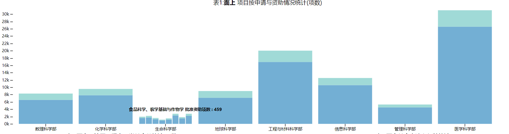
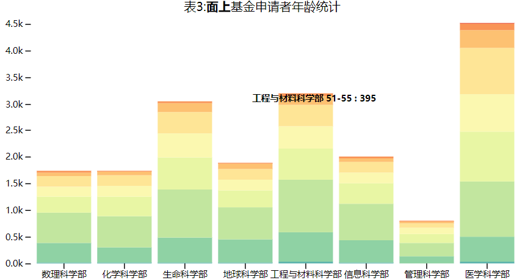
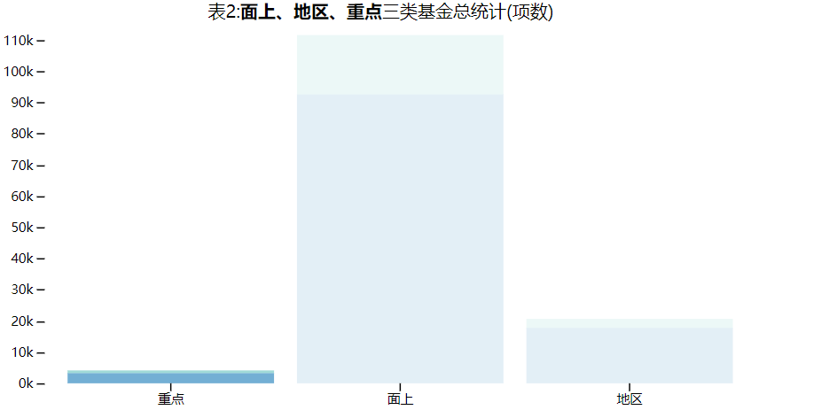
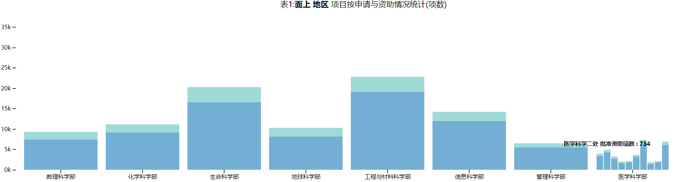
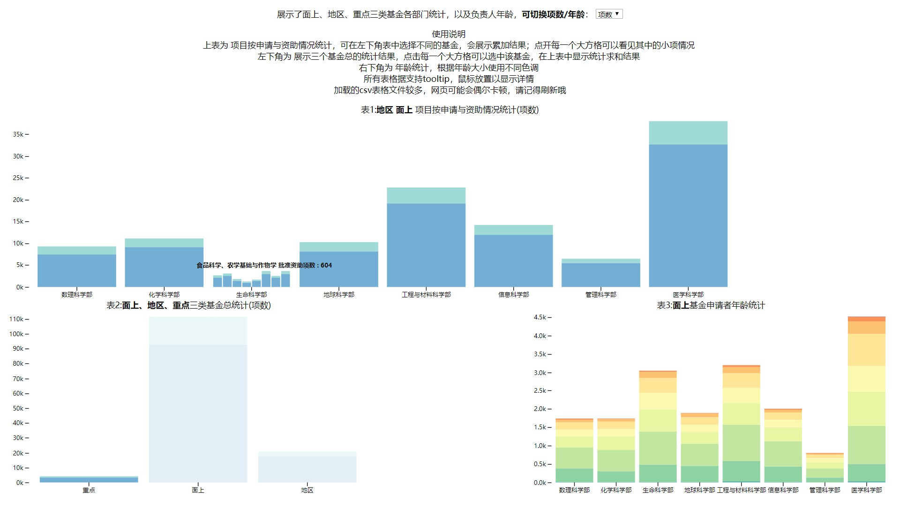

## visclass_f19_a01_report

#### 数据描述和分析：

- 选取的数据源共 **六张表格**：
  - 2018年面上项目按申请与资助情况统计
  - 2018年地区科学基金项目（按申请与资助情况统计）
  - 2018年重点项目按申请与资助情况统计
  - 2018年面上项目资助情况(按申请者年龄统计)
  - 2018年地区科学基金项目资助情况（按申请者年龄统计）
  - 2018年重点项目资助情况（按申请者年龄统计）
- 数据维度较大，包含的信息很多，包括**各个基金各个科学部负责人年龄统计、各个基金各个科学部（大部和其中每个小部）的受理申请项数金额、批准资助项数金额、比例、单项平均金额、资助率等信息**
- 数据规模大，包含六张表单的内容，需要处理近百条复杂数据及其依赖关系
- 数据特性：存在关系复杂，数据间包括了并列关系、比较关系、包含关系等，如何选择合适的方式可视化是一个巨大的挑战
- 可开展的分析点：**可以对不同学部的受理申请和批准资助的金额进行对比**，**可以对不同基金之间进行横向的比较**，**可以对不同基金进行统计比较**，**可以对学部内的小学部进行比较**，**可以对年龄分布进行比较**

#### 设计宗旨：

- 单个表单的可视化：

  - 

    表1：可以在选定基金的前提下，对不同大学部，大学部下的不同小学部进行比较

    采用堆叠图的形式，将项数（或金额）申请和批准的多少反映出来

    我的关注点为 纵向比较和横向比较相结合，并努力表现出学部间的包含关系

    **优点：采用交互式的设计，可以通过点击大块=》分裂为小块的方式 展现学部间的包含关系**

    **采用堆叠图，反映出纵向比较的信息**

  - 

    表3：表现年龄分布

    同样采用堆叠图的形式，并根据年龄的大小选择不同的颜色

    我的关注点为 如何直观地表现一个学部中年龄的大致分布，因为年龄也是一个定序的数据类型

    **优点：通过堆叠图年龄颜色的表现，可以直观反映年龄的大致分布**

- 多个表单整合：

  - 

    表2：表2中的不同基金可以进行选择，（选中的基金，如面上、地区，表现为半透明），从而影响到表1的统计结果

    

    表1中会对这几类基金进行累加统计，交互式反映出不同基金组合下学部的不同分布

- 存在不足：

  - 选中的基金 相差量级过大（如重点和面上间的差距过大），这种表现方式可能并不是最优解

#### 可视化结果描述

- **作业特点：**

  - **交互性优异**
  - **可以通过右上角的下拉菜单 切换指标 （项数/金额）**
  - **可以在表2中进行选择（多选），选中的基金会影响表1中的统计结果**
  - **表1中的大块可以点击，化为改大部门内部的小部门，由此灵活反映部门间的包含关系**
  - **对表2的选择会影响表3中的内容，从而反映 不同基金的年龄的分布**

  - **所有的表格均支持tooltip，可以通过鼠标放置的方式 详细的反映内容**
  - **配色精挑细选，如表3，通过不同的颜色表现不同的年龄，使得表现更为直观**

- 

- **从图表中的发现：**
  - 21世纪是生命科学的世纪，生科牛逼（
  - 生科 + 医学 不管从**年龄构成** 还是 **投入金额**来说，都明显领先于其他学部
  - 从年龄构成上来看，年轻团队正在逐渐兴起
  - 国家自然科学基金 的审核相当严谨，批准率甚高
- **感受：**
  - 如何选择合适的交互手段非常重要
  - 处理数据需要一定的经验，真实数据维度过大，难以表现完全，需要根据自己的任务合理选择